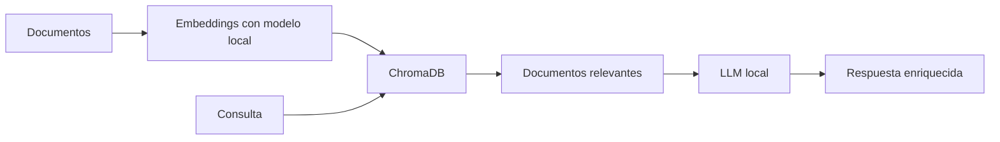

### **Respuesta Directa: ML y RAG en ARCA**  

#### **1. ¿Dónde entra *Machine Learning*?**  
- **Clasificación automática:**  
  - Usar `scikit-learn` (TF-IDF + Naive Bayes) para etiquetar documentos (ej: "Este texto es de #finanzas o #salud").  
  - Ejemplo mínimo:  
    ```python  
    from sklearn.feature_extraction.text import TfidfVectorizer  
    from sklearn.naive_bayes import MultinomialNB  

    # Datos de entrenamiento (texto -> tag)  
    textos = ["BTC subió un 10%", "Riego en plantas cada 2 días"]  
    tags = ["#trading", "#cultivo"]  

    # Entrenar modelo  
    vectorizer = TfidfVectorizer()  
    X = vectorizer.fit_transform(textos)  
    modelo = MultinomialNB().fit(X, tags)  

    # Predecir  
    nuevo_texto = "ETH en resistencia"  
    print(modelo.predict(vectorizer.transform([nuevo_texto])))  # Output: "#trading"  
    ```  

- **Detección de patrones:**  
  - Analizar logs con `pandas` para encontrar horas productivas o errores recurrentes.  

---

#### **2. ¿Dónde y cómo usar *RAG*?**  
- **Búsqueda semántica con ChromaDB:**  
  - **Flujo RAG en ARCA:**  
    1. **"Retrieval" (Recuperación):**  
       - ChromaDB compara tu consulta ("ejemplo cultivo tomates") con embeddings de tus documentos.  
       - Devuelve los 3 textos más relevantes.  
    2. **"Augmented Generation" (Generación aumentada):**  
       - Un LLM local (Mistral) resume los documentos recuperados.  

  - **Código mínimo:**  
    ```python  
    import chromadb  
    from sentence_transformers import SentenceTransformer  

    # 1. Crear base de vectores  
    client = chromadb.PersistentClient(path="arca_db")  
    collection = client.create_collection("documentos")  

    # 2. Generar embeddings (modelo local)  
    model = SentenceTransformer("all-MiniLM-L6-v2")  
    textos = ["Guía cultivo tomates", "Regar cada 3 días en verano"]  
    embeddings = model.encode(textos)  

    # 3. Indexar  
    collection.add(  
        ids=["doc1", "doc2"],  
        embeddings=embeddings,  
        documents=textos  
    )  

    # 4. Consultar  
    resultados = collection.query(  
        query_texts=["¿Cada cuánto regar tomates?"],  
        n_results=2  
    )  
    print(resultados["documents"])  # Muestra los documentos relevantes  
    ```  

---

### **Resumen Visual**  


**Key:**  
- **ML:** Para tareas estructuradas (clasificar, predecir).  
- **RAG:** Para buscar y generar respuestas basadas en tu conocimiento almacenado.  

--- 

### **3. ¿Qué aprender ahora mismo?**  
1. **Primeros pasos con ChromaDB:**  
   - Instalar: `pip install chromadb sentence-transformers`  
   - Probar el código de arriba con 2-3 documentos de ejemplo.  
2. **Experimento ML:**  
   - Clasificar 10 notas tuyas en 2 categorías con `scikit-learn`.  

**No necesitas más teoría por ahora.** Implementa esto y luego escalamos.