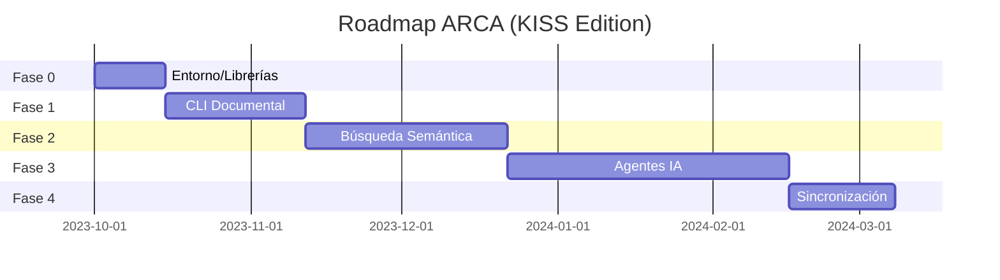

### **Roadmap KISS para ARCA: Fases Realistas de Implementación**  
Basado en el whitepaper de ARCA y las librerías disponibles, este roadmap prioriza **aprendizaje progresivo** y **valor tangible por iteración**. Usaremos el principio **"Menos es más"** (KISS) para evitar sobrecarga técnica.  

---

### **Fase 0: Preparación (1-2 semanas)**  
**Objetivo:** Entorno funcional + dominio de librerías clave.  
**Tareas:**  
1. **Instalar dependencias base:**  
   ```bash  
   pip install blake3 ruamel.yaml loguru typer rich sqlite  
   ```  
2. **Aprender fundamentos:**  
   - `pathlib`/`shutil` (gestión archivos).  
   - `blake3` (hashing para integridad).  
   - `ruamel.yaml` (metadatos estructurados).  
   - `loguru` (registros auditables).  
3. **Crear repositorio:**  
   - Estructura inicial de carpetas:  
     ```  
     arca/  
     ├── core/           # Lógica principal  
     ├── data/           # Documentos/metadatos  
     ├── tests/          # Pruebas unitarias  
     └── requirements.txt  
     ```  

---

### **Fase 1: Núcleo Documental (3-4 semanas)**  
**Objetivo:** CLI básica para guardar/buscar documentos con trazabilidad.  
**Librerías clave:** `typer`, `sqlite`, `blake3`, `ruamel.yaml`, `loguru`.  
**Tareas:**  
1. **Comandos CLI:**  
   ```python  
   # Ejemplo usando Typer  
   import typer  
   app = typer.Typer()  

   @app.command()  
   def guardar(ruta: str, tags: str):  
       # 1. Calcular hash (blake3)  
       # 2. Extraer metadatos (autor, fecha)  
       # 3. Guardar en SQLite + archivo YAML  
   ```  
2. **Base de conocimiento:**  
   - Tabla SQLite: `id`, `ruta`, `hash`, `tags`, `fecha_creacion`.  
3. **Auditoría básica:**  
   - Logs con `loguru`: Registrar cada operación con hash asociado.  
**Salida tangible:**  
- Comando `arca guardar doc.md --tags "#IA"` que:  
  ✓ Almacena el documento.  
  ✓ Genera metadatos.  
  ✓ Registra acción en log.  

---

### **Fase 2: Búsqueda Semántica (4-6 semanas)**  
**Objetivo:** Buscar documentos por contenido (no solo tags).  
**Librerías clave:** `chromadb`, `numpy`, `pandas`.  
**Tareas:**  
1. **Integrar ChromaDB:**  
   ```python  
   import chromadb  
   client = chromadb.PersistentClient(path="arca_db")  
   collection = client.create_collection("documentos")  
   ```  
2. **Procesamiento de texto:**  
   - Extraer texto de documentos (PDF, Markdown).  
   - Generar embeddings con modelo local (ej: `all-MiniLM-L6-v2`).  
3. **Comando `/buscar`:**  
   ```bash  
   arca buscar "Conceptos sobre IA" --semantica  
   ```  
**Salida tangible:**  
- Búsquedas por similitud semántica (ej: "cultivo" encuentra "agricultura urbana").  

---

### **Fase 3: Agentes Especializados (6-8 semanas)**  
**Objetivo:** Agentes locales para automatizar tareas.  
**Librerías clave:** `scikit-learn`, `joblib`.  
**Tareas:**  
1. **Agente "Auditor":**  
   - Verifica integridad de documentos (hash actual vs. almacenado).  
   - Clasifica documentos con `scikit-learn` (ej: tema=finanzas/salud).  
2. **Agente "Organizador":**  
   - Sugiere tags automáticos basados en contenido.  
   - Ejemplo de entrenamiento:  
     ```python  
     from sklearn.feature_extraction.text import TfidfVectorizer  
     from sklearn.naive_bayes import MultinomialNB  
     # Entrenar con documentos etiquetados  
     ```  
**Salida tangible:**  
- Auto-tagging de documentos y alertas de corrupción.  

---

### **Fase 4: Sincronización Segura (2-3 semanas)**  
**Objetivo:** Sincronizar entre dispositivos sin nube.  
**Librerías clave:** `cryptography` (no listada, pero necesaria).  
**Tareas:**  
1. **Cifrado AES-GCM:**  
   - Encriptar datos antes de sincronizar.  
2. **Comando `/sincronizar`:**  
   - Sincronizar vía LAN usando `socket` (o integrar Syncthing).  
**Salida tangible:**  
- `arca sincronizar --dispositivo "portatil"` encripta y transfiere cambios.  

---

### **Hoja de Ruta Visual**  


---

### **Plan de Aprendizaje por Fase**  
| Fase | Enfoque de Estudio | Recursos Recomendados |  
|------|---------------------|------------------------|  
| **0** | Python intermedio, POO, manejos de paquetes. | *Python Crash Course* (libro), tutoriales Typer/Loguru. |  
| **1** | Bases de datos SQLite, teoría de hashing. | *SQLite Tutorial* (sqlitetutorial.net), documentación Blake3. |  
| **2** | Embeddings, modelos NLP básicos. | *ChromaDB Docs*, curso "Introduction to NLP" (Coursera). |  
| **3** | Clasificación de texto, scikit-learn. | *Hands-On Machine Learning* (Cap. 3), ejemplos de TF-IDF. |  
| **4** | Criptografía aplicada, sockets. | *Cryptography with Python* (libro), tutoriales de sockets. |  

---

### **Principios Operativos**  
1. **KISS Extremo:**  
   - 200 líneas de código por módulo máximo.  
   - Priorizar funciones que aporten valor inmediato.  
2. **Aprendizaje Activo:**  
   - Cada nueva librería: implementar un *mini-proyecto* independiente antes de integrar.  
3. **Trazabilidad Obligatoria:**  
   - Commits diarios con logs verificables (`loguru + blake3`).  
4. **Tolerancia al Error:**  
   - Si algo falla, registrar *por qué* en `/data/errores` y refactorizar.  

> **Nota Crítica:** Este roadmap evita deliberadamente:  
> - LLMs complejos (hasta dominar Fase 3).  
> - Integración móvil/web (priorizar CLI robusta primero).  
> - Automatización de emociones/sujetividad.  

---

### **Primeros Pasos Hoy**  
1. **Ejercicio inicial (30 mins):**  
   ```python  
   # Usa ruamel.yaml para crear un archivo de metadatos  
   from ruamel.yaml import YAML  
   data = {"titulo": "Mi primer documento", "tags": ["#test"]}  
   with open("doc_meta.yaml", "w") as f:  
       YAML().dump(data, f)  
   ```  
2. **Meta diaria:**  
   - 1 hora de código + 30 mins documentando aprendizajes.  

**¡ARCA no se construye en un día, sino en iteraciones consistentes!**  
Si te atas en un paso, documenta el error y avanza al siguiente. El objetivo es **evolucionar con el sistema**, no la perfección.